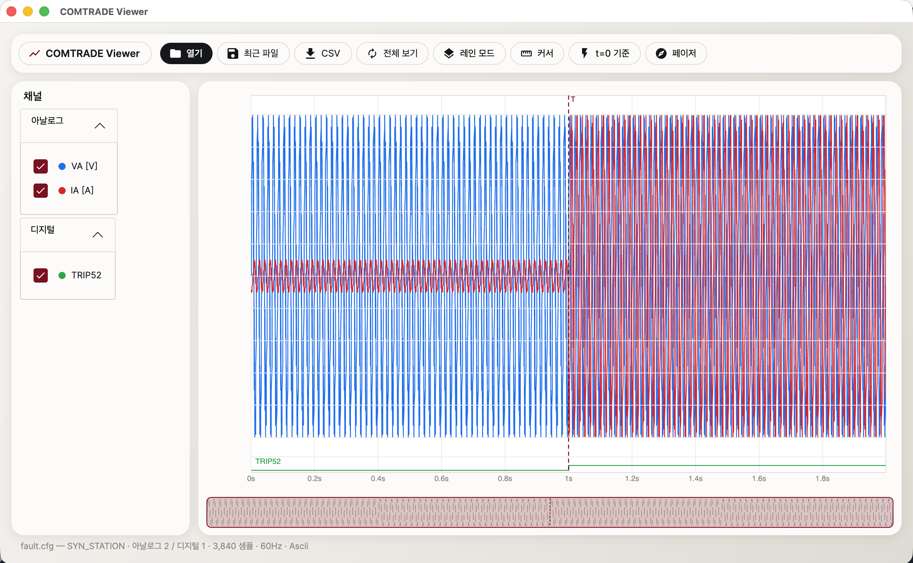
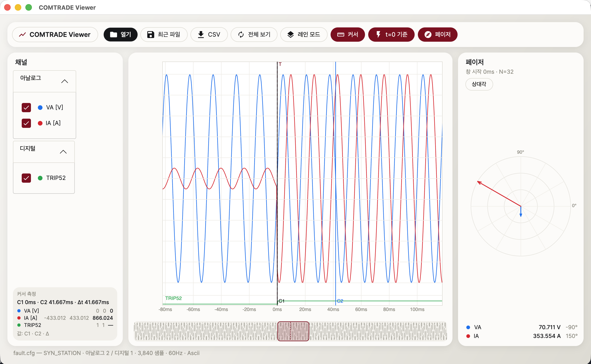

# COMTRADE Viewer

**보호계전기·고장기록장치(DFR)가 남기는 IEEE C37.111 COMTRADE 파일을 열어 파형을 보고, 시간을 재고, 페이저를 확인하는 분석 뷰어입니다.**

전력계통에서 고장이 발생하면 계전기와 고장기록장치는 그 순간의 전압·전류 파형을 COMTRADE(COMmon format for TRAnsient Data Exchange) 형식으로 저장합니다. 이 도구는 그 기록을 열어 "언제 고장이 시작됐고, 어느 상(相)이었고, 몇 ms 만에 차단됐는지"를 분석하기 위한 프로그램입니다. 지멘스·ABB·LS·GE 등 표준을 준수하는 모든 장비의 파일을 다루는 제조사 무관 범용 도구입니다.

  

## 화면

**파형 보기** — 채널 트리에서 켜고 끈 채널을 오버레이(단위 그룹별 공통 스케일) 또는 채널별 레인으로 표시합니다. 디지털 채널(트립·픽업 신호 등)은 하단에 0/1 스텝으로 그려지고, 트리거 시점은 세로 점선으로 표시됩니다. 아래 화면은 t=1.0s에 전류(IA)가 50A→500A로 급증하는 고장 기록입니다.



**분석** — 커서 2개를 드래그해 고장 시작~차단 완료 구간을 ms 단위로 측정하고(Δt·채널별 Δ값), 트리거 t=0 기준 상대시간 축으로 전환할 수 있습니다. 페이저 패널은 커서 위치에서 시작하는 1주기 풀사이클 DFT로 각 채널의 RMS 크기·위상각을 계산해 극좌표로 보여줍니다.



## 다운로드

**[Releases 페이지](../../releases/latest)** 에서 `ComtradeViewer-win-x64.zip`을 받아 압축을 풀고 `ComtradeViewer.exe`를 실행하면 됩니다.

- Windows 10 (1809+) / 11 x64
- .NET 런타임 설치 불필요 (self-contained 단일 실행파일)

## 주요 기능

| 기능 | 설명 |
|---|---|
| 파일 열기 | CFG 선택 시 동명 DAT 자동 탐색(대소문자 무관), 드래그&드롭, 최근 파일 10개 |
| 포맷 지원 | 1999 리비전 CFG/DAT (ASCII·BINARY), 2013 리비전 CFF 단일파일·BINARY32·FLOAT32 |
| 견고한 파싱 | 손상 파일도 크래시 없이 "몇 번째 행에서 왜 실패했는지" 표시. 다중 샘플레이트 구간 지원 |
| 대용량 성능 | min/max 봉투 데시메이션 — 100만 샘플 × 16채널에서도 팬/줌 프리즈 없음 (실측 ~9ms) |
| 팬/줌 | 마우스 휠 줌(커서 중심), 드래그 팬, 전체 보기 리셋, 하단 미니맵 타임라인 |
| 커서 측정 | 커서 2개 자유 배치 — 각 시각, 채널별 값, Δt(ms)·Δ값 |
| 트리거 | 트리거 시각 세로선 + t=0 기준 상대시간 축 토글 |
| 페이저 | 1주기 풀사이클 DFT (√2/N, cosine 기준 RMS) — 극좌표 다이어그램 + 표, 기준 채널 상대각 |
| CSV 내보내기 | 표시 중 채널·구간(커서 구간)을 스케일 적용 실값으로 내보내기 |

## 사용법

1. `ComtradeViewer.exe` 실행 후 [열기] 또는 CFG/CFF 파일을 창으로 드래그
2. 좌측 채널 트리에서 볼 채널 선택 — 색상은 자동 배정
3. 휠로 고장 구간 확대 → [커서]를 켜고 두 커서를 드래그해 구간 측정
4. [페이저]를 켜면 커서1 위치의 1주기 페이저가 극좌표로 표시
5. [CSV]로 분석 구간을 내보내 보고서에 첨부

명령행에서 파일을 바로 열 수도 있습니다: `ComtradeViewer.exe 기록파일.cfg`

## 빌드 (개발자)

```bash
dotnet build ComtradeViewer.sln
dotnet test          # 골든 벡터 + 합성 라운드트립 64 테스트
```

단일 exe 배포:

```bash
dotnet publish src/Ncv.App -c Release -r win-x64 --self-contained true \
  -p:PublishSingleFile=true -p:IncludeNativeLibrariesForSelfExtract=true \
  -p:EnableCompressionInSingleFile=true -o publish/win-x64
```

### 프로젝트 구조

```
src/Ncv.Core/          파서·모델·연산 라이브러리 (UI 의존 없음, Stream 기반)
  Format/              CfgParser, DatAsciiReader, DatBinaryReader, CffReader
  Model/               ComtradeRecord, Timeline
  Analysis/            Decimator(min/max 봉투), PhasorDft(풀사이클 DFT)
  Export/              CsvExporter
src/Ncv.App/           Avalonia UI — 차트 라이브러리 없이 직접 드로잉
  Controls/            WaveformPlotControl, MinimapControl, PhasorControl
tests/Ncv.Core.Tests/  골든 벡터 + 합성 라운드트립 테스트
tests/fixtures/real/   실측 파일 회귀 (CFG+DAT를 넣으면 자동 포함)
```

파서 검증은 라운드트립 원칙을 따릅니다: 수식으로 합성한 파형 → 테스트 전용 Writer로 CFG/DAT 생성 → 파서로 읽어 원본 수식값과 비교. 테스트 데이터에 하드코딩된 파형은 없습니다.
